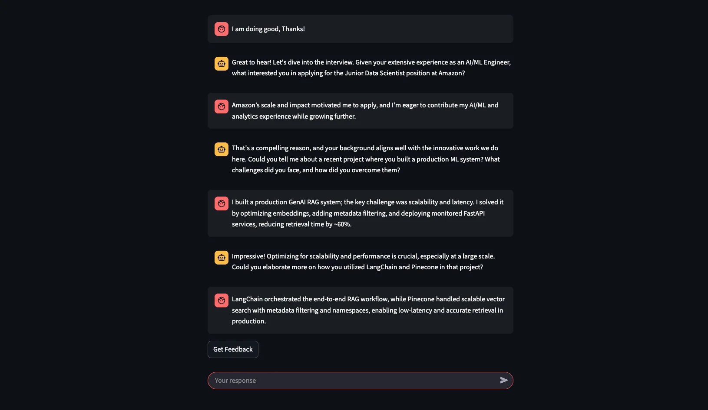
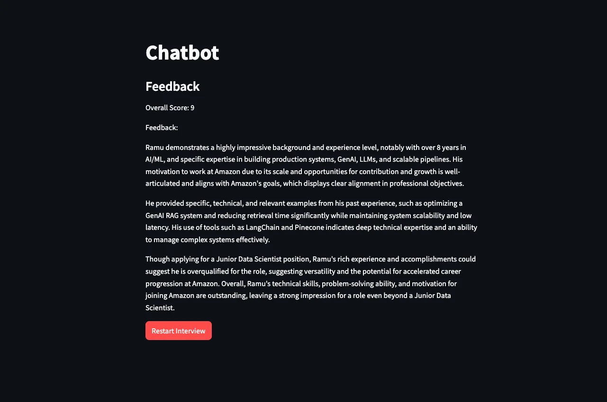

# AI Interview & Feedback Tool 💬

[](https://www.python.org/downloads/)
[](https://streamlit.io/)
[](https://opensource.org/licenses/MIT)
[](https://openai.com/)
[](https://streamlit.io/cloud)

An interactive AI-powered interview simulator built with Streamlit and OpenAI's GPT-4. This application conducts mock interviews for various data and analytics positions and provides detailed performance feedback.

> **Note:** This application has been successfully deployed on Streamlit Cloud and is production-ready.

## 📸 Screenshots

<div align="center">

### Setup Interface

*Customize your interview with personal information, experience level, desired position, and target company*

### Interactive Interview

*Real-time AI-powered conversation with GPT-4 acting as an HR executive*

### Performance Feedback

*Receive a detailed performance score (1-10) with comprehensive feedback and suggestions*

</div>

## ✨ Features

- **Personalized Interview Experience**: Customize your interview based on your name, experience, and skills
- **Multiple Job Positions**: Choose from Data Scientist, Data Engineer, ML Engineer, BI Analyst, or Financial Analyst
- **Experience Levels**: Select Junior, Mid-level, or Senior positions
- **Top Companies**: Interview for positions at Amazon, Meta, Udemy, 365 Company, Nestle, LinkedIn, or Spotify
- **Real-time AI Conversations**: Interactive chat interface with GPT-4 powered HR executive
- **Performance Feedback**: Get scored feedback (1-10) on your interview performance after completion

## 🚀 Demo

The interview process includes:
1. **Setup Phase**: Provide your personal information and select job preferences
2. **Interview Phase**: Interactive conversation with 5 question-answer exchanges
3. **Feedback Phase**: Detailed performance analysis with scoring and improvement suggestions

## 📦 Installation

### Prerequisites

- Python 3.8 or higher
- OpenAI API key

### Setup

1. Clone this repository:
```bash
git clone https://github.com/RamuGanta/Interview-and-Feedback-tool.git
cd Interview-and-Feedback-tool
```


2. Install required packages:
```bash
pip install streamlit openai streamlit-js-eval
```

3. Create a `.streamlit` directory in the project root:
```bash
mkdir .streamlit
```

4. Create a `secrets.toml` file inside `.streamlit` directory:
```bash
touch .streamlit/secrets.toml
```

5. Add your OpenAI API key to `.streamlit/secrets.toml`:
```toml
OPENAI_API_KEY = "your-api-key-here"
```

**Important**: Never commit your `secrets.toml` file to GitHub. It's included in `.gitignore`.

## 💻 Usage

1. Run the Streamlit app:
```bash
streamlit run interview_feedback.py
```

2. Open your browser and navigate to the URL shown in the terminal (typically `http://localhost:8501`)

3. Fill in your personal information:
   - Name
   - Experience
   - Skills
   - Desired level (Junior/Mid-level/Senior)
   - Position
   - Target company

4. Click "Start Interview" and begin your mock interview

5. Answer 5 interview questions in the chat interface

6. Click "Get Feedback" to receive your performance evaluation

7. Use "Restart Interview" to try again with different settings

## 📁 Project Structure

```
.
├── interview_feedback.py    # Main application file
├── README.md                 # Project documentation
├── requirements.txt          # Python dependencies
├── .gitignore               # Git ignore file
├── screenshots/             # Application screenshots
└── .streamlit/
    └── secrets.toml         # API keys (not tracked by git)
```

## ⚙️ Configuration

### Customizing the Interview

You can modify the interview experience by editing `interview_feedback.py`:

- **Number of Questions**: Change `st.session_state.user_message_count < 5` to adjust the number of interview rounds
- **Model Selection**: Update `"gpt-4o"` to use different OpenAI models
- **Character Limits**: Adjust `max_chars` values for input fields
- **Available Positions**: Add or remove positions in the selectbox options
- **Companies**: Customize the list of companies

## 🛠️ Technologies Used

- **[Streamlit](https://streamlit.io/)**: Web framework for creating the interactive UI
- **[OpenAI API](https://openai.com/)**: GPT-4 for generating interview questions and feedback
- **[streamlit-js-eval](https://github.com/aghasemi/streamlit_js_eval)**: JavaScript evaluation for page reload functionality

## 🔍 How It Works

1. **Setup Phase**: Collects user information and interview preferences
2. **Interview Phase**: 
   - Initializes GPT-4 with a system prompt containing user details
   - Conducts a conversational interview with streaming responses
   - Tracks message count to limit interview length
3. **Feedback Phase**:
   - Sends the complete conversation history to GPT-4
   - Generates structured feedback with a numerical score
   - Provides actionable suggestions for improvement

## ⚠️ Limitations

- Interview is limited to 5 user responses
- Requires an active OpenAI API key with sufficient credits
- Input text is limited to prevent excessive token usage
- Feedback is generated by AI and should be used as a learning tool, not as professional career advice

## 🔮 Future Enhancements

- [ ] Add voice input/output capabilities
- [ ] Include video interview simulation
- [ ] Provide industry-specific interview questions
- [ ] Save interview history and track progress over time
- [ ] Add more detailed analytics on response quality
- [ ] Support for multiple languages
- [ ] Export feedback as PDF report

## 🤝 Contributing

Contributions are welcome! Please feel free to submit a Pull Request.

1. Fork the repository
2. Create your feature branch (`git checkout -b feature/AmazingFeature`)
3. Commit your changes (`git commit -m 'Add some AmazingFeature'`)
4. Push to the branch (`git push origin feature/AmazingFeature`)
5. Open a Pull Request

## 📄 License

This project is licensed under the MIT License - see the [LICENSE](LICENSE) file for details.

## 🙏 Acknowledgments

- Built with [Streamlit](https://streamlit.io/)
- Powered by [OpenAI](https://openai.com/)
- Inspired by the need for accessible interview practice tools

## 📞 Support

For issues, questions, or suggestions, please open an issue on GitHub.

## 👤 Author

**Ramu Ganta**

[](https://github.com/RamuGanta)

---

**Note**: This is an educational tool designed to help with interview preparation. Always practice with real human interviewers as well for the best preparation.
